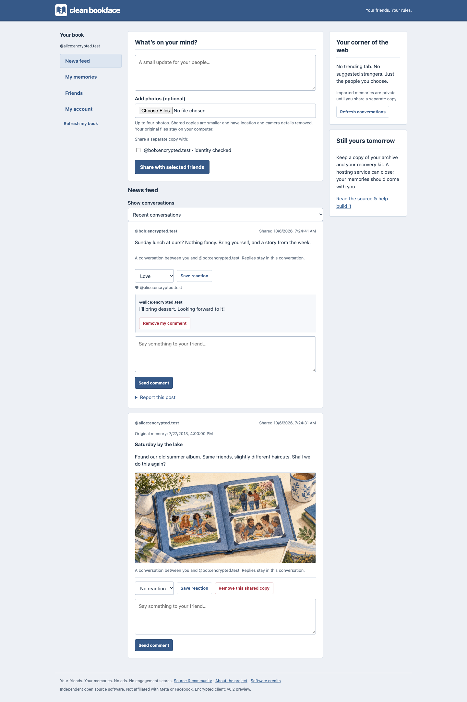
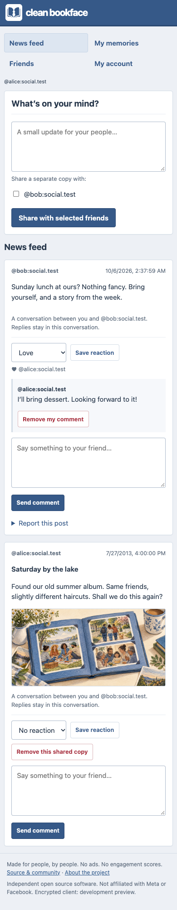
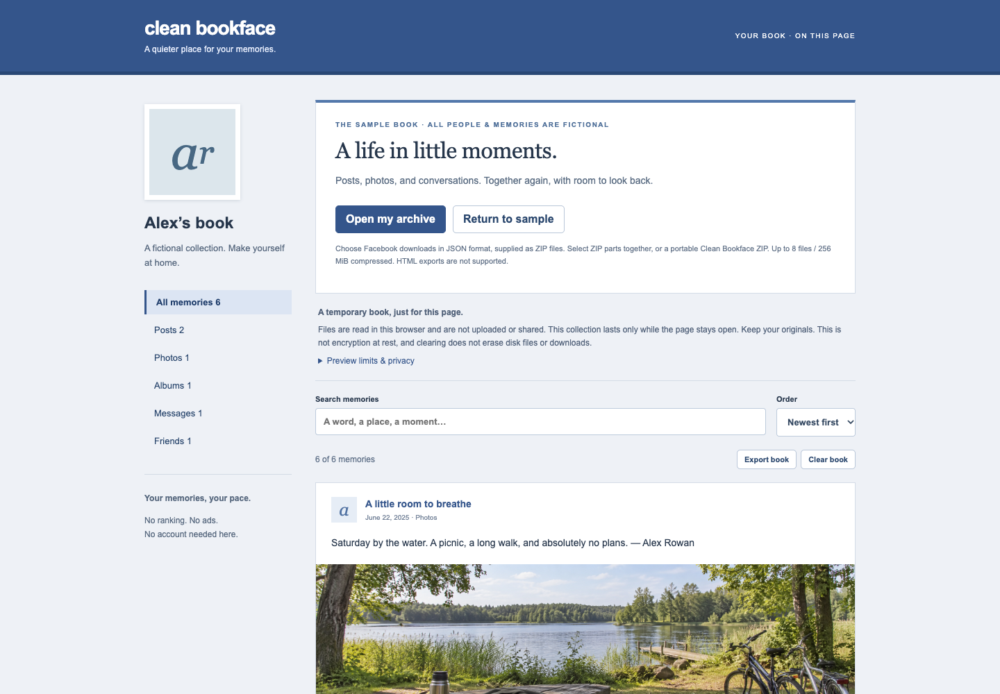

# Clean Bookface

**Your friends. Your memories. No advertising department.**

A social network should tell you how your friends are doing. It shouldn't need to sell you something on the way.

Clean Bookface is a small, self-hosted social network with the feel of early Facebook: a blue bar, photos, comments and friends' posts in order. It can also give your Facebook download a home. Your old memories stay private until you choose to share them.

**[Try a sample book](https://app.cleanbookface.org/book.html)** · **[Open a book on this device](docs/LOCAL_BOOK.md)** · **[Join a friend](docs/ENCRYPTED_GETTING_STARTED.md#join-someone-you-know)** · **[Help build it](docs/COMMUNITY.md)**

Start with the sample. No account, download or server setup: browse a few fictional memories, search for a story and open a photograph. It shows the archive reader; private sharing belongs to a separate circle.

_Encrypted preview · Free software for small circles. There is no official hosting service or public sign-up. Host dependencies still have unresolved security advisories, and independent human security, accessibility and usability reviews remain open. Use fictional memories while those checks are unfinished. [What has been tested](encrypted-client/QUALIFICATION.md)._

The encrypted app, with fictional accounts and posts. These are screenshots of working software, including verified conversations, photos, reactions and comments.

See it on a phone

## Start on your own

You don't need to move your friends before you can explore a book. The [local reader](https://app.cleanbookface.org/book.html) opens supported archive files in this browser. It doesn't upload the selected files or save the opened collection in browser storage. Close or reload the page and you will need to open your original files again. You can download a separate portable copy, but keep your original Facebook download too.

This is a preview, so start with the fictional sample. The local reader does not encrypt your originals or its downloaded copy. [What stays on your device, supported files and limits](docs/LOCAL_BOOK.md).

## Bring a friend when you're ready

A **circle** is a Clean Bookface site run by you or someone you trust. Everyone has their own account. Ask a friend who runs one for an invitation, create your account and save your recovery kit. Keep that kit somewhere private, away from this browser.

That's all the setup you need to join. No terminal, hosting account or GitHub account. You can write your first post without bringing anything from Facebook.

If you want your old memories here too:

1. **Ask Facebook for your download.** Choose **JSON** as the format. You don't need to read or edit those files. [The guide shows which settings to choose.](docs/ENCRYPTED_GETTING_STARTED.md#bring-your-facebook-download)
2. **Keep an original copy.** Download every part and save a separate backup somewhere private.
3. **Open My memories.** Select all the ZIP parts together, keep the tab open and read the import warnings. Nothing is posted to your friends.
4. **Share something you choose.** Accept each other as friends, compare the identity check over a call, then pick a memory and choose who can see it. Or keep the whole archive to yourself.

## Nobody you know runs a circle?

You can run a storage home for your friends. [The encrypted hosting guide](encrypted-host/SELF_HOST.md) covers a new home, its address, private invitations and tested backups. Your friends use a separately published browser app to open their encrypted memories.

Hosting does mean looking after a server, updates and backups. A host needs Linux, Docker and someone willing to maintain it. Joining a friend's home avoids that work. [Compare the practical choices and a small shared-server budget](docs/ENCRYPTED_HOSTING.md) before renting anything. The software is free; hosting, storage and a domain may cost money.

GitHub is where you get the software and help improve it. Your friends use your circle's website.

## The useful part of social networking

- **Friends' posts, in order.** No ads, suggested strangers or infinite scroll. Catch up and get on with your day.
- **A place for your history.** Browse supported posts, photos, albums and message history. Imported conversations have no sharing button.
- **Your own company.** Invite friends, reply, react or block as needed. Importing a friend list doesn't contact anyone or add them as friends here.
- **An exit that works both ways.** Download your saved imports, save your conversations, move your memories to another home or close your account. Your recovery kit lets you open your encrypted memories in a new browser.

## Leaving Facebook is your decision

You can download your information and keep using Facebook. You can also take a break or request deletion through Facebook's settings. Neither choice is a condition of joining here.

**Clean Bookface never asks for your Facebook password. Importing here does not delete anything there.** Check your original download and anything that depends on your Facebook account before deciding to leave. [The guide explains downloading, importing and optional deletion separately.](docs/GETTING_STARTED.md#6-decide-what-you-want-to-do-with-facebook)

## Terms of disengagement

We have no exciting opportunity to monetize your friendships.

We do have a few things you should know before uploading:

- **Know who handles your keys.** The browser encrypts memories before they reach the storage home. The app publisher still has to be trusted: someone who replaces the app can steal keys. A different web address alone does not make the publisher independent. Homes still see account names, friendships, timing and file sizes.
- **Keep your original download.** Facebook exports vary and not everything is supported. Check the import report for skipped or missing items.
- **A shared copy is a shared copy.** Friends can save what you send them. Removing a post cannot erase a screenshot; older backups can retain deleted data until the host removes them.
- **People, please.** Bots, automated personas, scraping and bulk posting are against the rules. Invitations, limits, reports and moderation help enforce them. Accessibility tools are welcome. We don't ask for ID documents or claim perfect bot detection.

Read the [encryption contract](docs/ENCRYPTION.md) and [moving, recovery and account-closing guide](docs/ENCRYPTED_GETTING_STARTED.md#move-recover-or-leave). A host is responsible for explaining their own hosting and retention arrangements.

Already using **v0.1**? Its host can read stored memories; it has not become encrypted through a website update. Keep the old installation until you have exported your account, imported a separate encrypted copy and recovered that copy successfully. [Migration and the remaining privacy limits](docs/ENCRYPTED_GETTING_STARTED.md#move-recover-or-leave).

## Pull up a chair

This is an open-source project in public preview. We'd like people to help maintain it, including people who don't write code.

Found a confusing instruction or a button that doesn't work with your keyboard? That's useful feedback. You can [report a problem](https://github.com/Dynobit/clean-bookface/issues) or suggest a change. **Use made-up examples. Never attach your Facebook download, recovery codes or private conversations.** See [security reporting](SECURITY.md) for vulnerabilities.

There are [five small starter tasks](docs/CONTRIBUTOR_TASKS.md): check the sample with a keyboard or screen reader, try a fictional import in your browser, describe a confusing first step, add an archive fixture, or rehearse a disposable backup. [Community questions and maintenance roles](docs/COMMUNITY.md) explain where to start; [Contributing](CONTRIBUTING.md) covers branches and checks.

The project is still owner-maintained. We welcome people who want to take responsibility for a part of it; no maintainer group has been appointed yet. [Community stewardship](GOVERNANCE.md) explains how decisions and responsibilities can be shared without giving contributors access to members’ data.

**[Releases and downloads](https://github.com/Dynobit/clean-bookface/releases)** · **[See what is tested and what remains](docs/RELEASE.md)** · **[Visit the project website](https://cleanbookface.org/)**

<strong>For hosts and developers: installation, backups and technical documentation</strong>

| I want to…                              | Read this                                                                                                                                 |
| --------------------------------------- | ----------------------------------------------------------------------------------------------------------------------------------------- |
| Host my first circle                    | [Encrypted home installation](encrypted-host/SELF_HOST.md)                                                                                |
| Choose a server and understand the bill | [Encrypted hosting choices and costs](docs/ENCRYPTED_HOSTING.md)                                                                          |
| Find advanced installation settings     | [Encrypted host operations](encrypted-host/OPERATIONS.md)                                                                                 |
| Back up, update or recover a circle     | [Backups and recovery](encrypted-host/OPERATIONS.md)                                                                                      |
| Connect circles on different servers    | [Cross-home connections](encrypted-host/FEDERATION.md)                                                                                    |
| Run the local demo or change the code   | [Encrypted client development](encrypted-client/README.md)                                                                                |
| Follow the encrypted browser work       | [Browser client and privacy boundaries](encrypted-client/README.md)                                                                       |
| Inspect the remaining release work      | [Release evidence](docs/RELEASE.md), [backlog](docs/BACKLOG.md), [security](SECURITY.md), [Opus review and fixes](docs/REVIEW_2026_10.md) |

Our album illustration and artwork credits

[Artwork credits](docs/ARTWORK.md) · [Album mark](public/assets/album-mark.svg) · [Favicon](public/favicon.svg)

MIT licensed. Clean Bookface is an independent project and working name, unaffiliated with Facebook or Meta.
