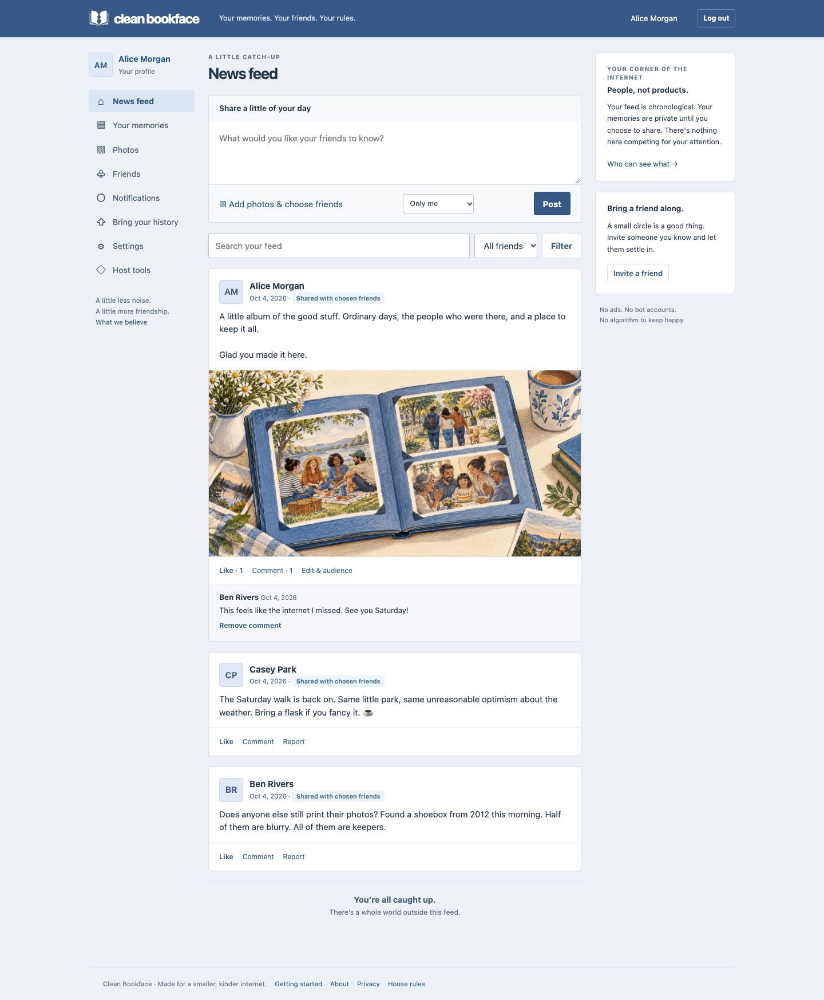
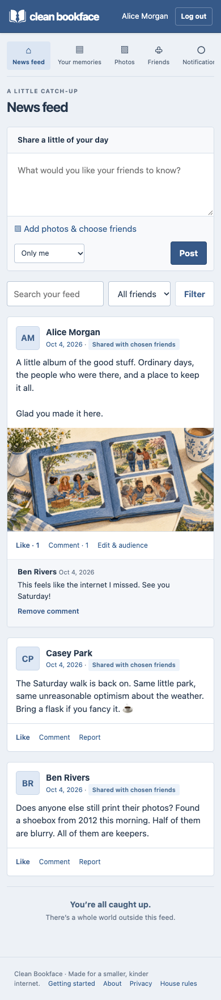

# Clean Bookface

**Your friends. Your memories. No advertising department.**

A social network should tell you how your friends are doing. It shouldn't need to sell you something on the way.

Clean Bookface is a small, self-hosted social network with the feel of early Facebook: a blue bar, photos, comments and friends' posts in order. It can also give your Facebook download a home. Your old memories stay private until you choose to share them.

**[Join a friend](docs/GETTING_STARTED.md#3-join-a-circle-you-trust)** · **[Bring your memories](docs/GETTING_STARTED.md)** · **[Host your own circle](docs/HOST_YOUR_CIRCLE.md)** · **[Help build it](CONTRIBUTING.md)**

_v0.1 public preview · Free software for small circles. There is no official hosting service or public sign-up. Independent human security, accessibility and usability reviews remain open. [Release status](docs/RELEASE.md)._

The v0.1 app, with fictional people and posts. These are screenshots of working software.

See it on a phone

## Start with a friend

A **circle** is a Clean Bookface site run by you or someone you trust. Everyone has their own account. Ask a friend who runs one for an invitation, create your account and save your recovery codes.

That's all the setup you need to join. No terminal, hosting account or GitHub account. You can write your first post without bringing anything from Facebook.

If you want your old memories here too:

1. **Ask Facebook for your download.** Choose **JSON** as the format. You don't need to read or edit those files. [The guide shows which settings to choose.](docs/GETTING_STARTED.md)
2. **Keep an original copy.** Download every part and save a separate backup somewhere private.
3. **Open Bring your history.** Import the download, then check **Your memories** and the import report. Nothing is posted to your friends.
4. **Share something you choose.** Accept each other as friends, pick a memory, preview it and choose who can see it. Or keep the whole archive to yourself.

## Nobody you know runs a circle?

You can run one for your friends. The [five-step hosting guide](docs/HOST_YOUR_CIRCLE.md) walks through choosing a server, giving it a web address, running the setup helper and making your account. The app then helps you work through the host checklist.

Hosting does mean looking after a server, updates and backups. The guided setup uses Linux, Node.js and Docker; you don't have to write code. [Compare the practical options and costs](docs/HOSTING.md) before committing to a monthly bill. The software is free; hosting, storage and a domain may cost money.

GitHub is where you get the software and help improve it. Your friends use your circle's website.

## The useful part of social networking

- **Friends' posts, in order.** No ads, suggested strangers or infinite scroll. Catch up and get on with your day.
- **A place for your history.** Browse supported posts, photos, albums and message history. Imported conversations have no sharing button.
- **Your own company.** Invite friends, favorite people, mute or block as needed. Importing a friend list doesn't contact anyone or add them as friends here.
- **An exit that works both ways.** Download your account, move your memories to another circle or delete your account in Settings.

## Leaving Facebook is your decision

You can download your information and keep using Facebook. You can also take a break or request deletion through Facebook's settings. Neither choice is a condition of joining here.

**Clean Bookface never asks for your Facebook password. Importing here does not delete anything there.** Check your original download and anything that depends on your Facebook account before deciding to leave. [The guide explains downloading, importing and optional deletion separately.](docs/GETTING_STARTED.md#6-decide-what-you-want-to-do-with-facebook)

## Terms of disengagement

We have no exciting opportunity to monetize your friendships.

We do have a few things you should know before uploading:

- **Trust your host.** Other members cannot browse your private archive through the app. The person running the server can access its stored data. This version is not end-to-end encrypted.
- **Keep your original download.** Facebook exports vary and not everything is supported. Check the import report for skipped or missing items.
- **A shared copy is a shared copy.** Friends can save what you send them. Removing a post cannot erase a screenshot; older backups can retain deleted data until the host removes them.
- **People, please.** Bots, automated personas, scraping and bulk posting are against the rules. Invitations, limits, reports and moderation help enforce them. Accessibility tools are welcome. We don't ask for ID documents or claim perfect bot detection.

Read the [privacy contract](docs/PRIVACY.md) and [account export and deletion guide](docs/PORTABILITY.md). A host is responsible for explaining their own hosting and retention arrangements.

An encrypted version is being built separately, so a storage host would not receive the keys to your memories. It is **not ready for personal archives** and has not replaced this preview. [Follow the work and its remaining problems in draft PR #4.](https://github.com/Dynobit/clean-bookface/pull/4)

## Pull up a chair

This is an open-source project in public preview. We'd like people to help maintain it, including people who don't write code.

Found a confusing instruction or a button that doesn't work with your keyboard? That's useful feedback. You can [report a problem](https://github.com/Dynobit/clean-bookface/issues) or suggest a change. **Use made-up examples. Never attach your Facebook download, recovery codes or private conversations.** See [security reporting](SECURITY.md) for vulnerabilities.

There are useful jobs waiting: try the instructions, check a screen with a keyboard or screen reader, test a made-up archive, or rehearse a backup. [Pick a small task](docs/BACKLOG.md#community-priorities), then use [Contributing](CONTRIBUTING.md) to find the right branch and checks.

The project is still owner-maintained. We welcome people who want to take responsibility for a part of it; no maintainer group has been appointed yet. [Community stewardship](GOVERNANCE.md) explains how decisions and responsibilities can be shared without giving contributors access to members’ data.

**[Download the released preview](https://github.com/Dynobit/clean-bookface/releases/tag/v0.1.0-preview.1)** · **[See what is tested and what remains](docs/RELEASE.md)** · **[Visit the project website](https://cleanbookface.org/)**

<strong>For hosts and developers: installation, backups and technical documentation</strong>

| I want to…                              | Read this                                                                                |
| --------------------------------------- | ---------------------------------------------------------------------------------------- |
| Host my first circle                    | [Five-step hosting guide](docs/HOST_YOUR_CIRCLE.md)                                      |
| Choose a server and understand the bill | [Hosting and costs](docs/HOSTING.md)                                                     |
| Find advanced installation settings     | [Installation reference](docs/INSTALL.md)                                                |
| Back up, update or recover a circle     | [Operations](docs/OPERATIONS.md)                                                         |
| Connect circles on different servers    | [Cross-host connections](docs/FEDERATION.md)                                             |
| Run the local demo or change the code   | [Development guide](docs/DEVELOPMENT.md)                                                 |
| Inspect the remaining release work      | [Release evidence](docs/RELEASE.md), [backlog](docs/BACKLOG.md), [security](SECURITY.md) |

Our album illustration and artwork credits

[Artwork credits](docs/ARTWORK.md) · [Album mark](public/assets/album-mark.svg) · [Favicon](public/favicon.svg)

MIT licensed. Clean Bookface is an independent project and working name, unaffiliated with Facebook or Meta.
