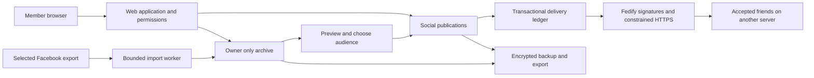

# Clean Bookface full build plan

Implementation contract, updated 2026-10-05. The repository now contains a working private application, including the private archive, same-host circle and constrained cross-server sharing. The acceptance criteria below remain the release contract; implementation and passing automated tests do not establish a public production release.

The product should make it easy to bring a Facebook archive home, choose what to share, and reconnect with people without surrendering control of the feed. A nontechnical member should need only an invitation and a browser. A technically willing member should be able to host the same software for a small circle, without a paid product dependency.

## Implementation status

| Area | Implemented evidence | Acceptance still open |
| --- | --- | --- |
| Foundation and accounts | Typed Hono application, SQLite component schema checks, Argon2id, invitations, sessions and recovery; `tests/config.test.ts`, `tests/core.test.ts`, `tests/http_security.test.ts` | Review the exact release source/history and qualification evidence before publication |
| Private archive | Bounded worker, JSON/split-ZIP imports, durable originals, revisions, private search/photos/albums; `tests/archive.test.ts` | Broad real-export diversity has not been qualified; HTML and shared video remain excluded |
| Friend circle | Mutual friends, recipient snapshots, photo albums as grouped posts, comments/likes, quiet notifications, mute/favorites/block/report/appeal; core and HTTP tests | Five observed new-user sessions and independent accessibility/security review have not happened |
| Cross-host sharing | Actual isolated HTTPS peers, exact recipient checks, signed media, retries/restart, revocation/deletion and hostile input tests; `tests/federation.test.ts`, `tests/federation_http.test.ts` | General fediverse compatibility is deliberately unsupported; this is not evidence of an Internet deployment |
| Leaving and recovery | Actual HTTP export imports privately on another host; restic and encrypted operator recovery/reconciliation; `tests/portable.test.ts`, `tests/operations.test.ts` | Fresh provider-account deployment and the proposed workload envelope remain unqualified |

The local production-image HTTPS/restart/encrypted-restore smoke passed. The
50,000-record native workload passed under the conditions in [Performance](PERFORMANCE.md);
provider and 10 GB capacity qualification remain open. Final verification is
recorded in [Release evidence](RELEASE.md). The owner has selected a donated Pi
and Cloudflare Tunnel for a temporary invited pilot and bought the project
domains. The final image and off-host recovery have passed isolated Pi checks;
public routing and scheduled backup qualification remain open. No public release
or independent security audit is claimed. The per-task ledger in [BACKLOG.md](BACKLOG.md) preserves outstanding
acceptance work. Member migration is documented in [PORTABILITY.md](PORTABILITY.md).

## Product decisions

| Decision | v1 contract |
| --- | --- |
| Who the product serves | People keeping their memories and relationships; one person or a small trusted circle per installation |
| Archive input | Official Facebook JSON exports with their media, including split exports; folder import first, bounded ZIP upload before v1 |
| Initial supported history | Profile, own posts, photos/albums and private friend records; optional private message history; other categories explicitly reported |
| Sharing | New native posts or deliberately selected copies of archive items; imported chats, third-party comments, tags and friend lists do not become shared posts |
| Social features | Profiles, mutually accepted friends, text/photo posts, comments, a simple like, albums, chronological feed, mute/block/report |
| Cross-server scope | The tested Clean Bookface private-sharing profile over ActivityPub; address/invitation discovery and opt-in handle lookup |
| User experience | A 2012-inspired blue header, left navigation, readable wall and photo albums; responsive mobile layout and keyboard access |
| User control | Chronological feed by default; explicit sort/filter/favorites controls; quiet notifications; no engagement ranking, ads or growth loops |
| Nontechnical entry | Accept a friend's invitation; no hosting account, terminal, domain or payment required for a member |
| Portability | Export own data/media; encrypted backups; restore/move an installation while retaining its canonical domain and identity |
| Business posture | Free self-hostable software; no ad system, data brokerage, affiliate placement or paid visibility |

The first version will not ship new private messaging, calls, groups, events, marketplace, stories, recommendations, public relays, arbitrary fediverse compatibility, automatic global friend matching, or multi-region infrastructure. Video originals may be privately retained/downloaded when safely supported; shared video/transcoding is outside this release. These exclusions keep the complete release small enough to maintain.

No shared-server privacy claim should imply that its administrator cannot read the data. End-to-end encryption would require a separate design for keys, recovery, search and cross-server delivery. It is not promised for v1.

## The complete user journey

1. **Choose a home.** Accept an invitation or follow the guided hosting setup. See the host/operator, location chosen by the host, storage allowance and privacy explanation before uploading anything.
2. **Create an account.** Choose a display name and password; save recovery codes. No Facebook login, identity document, mandatory phone number or uploaded address book.
3. **Bring history.** Read a short guide to obtaining a JSON export. Select files, see estimated storage and supported categories, then import with visible progress and cancellation.
4. **Check the result.** Browse a private timeline and albums. An import report distinguishes new, unchanged, revised, skipped and failed records. Original dates and text are preserved.
5. **Reconnect.** Send or paste a profile/invitation link. Both people review and accept. Optional discovery exposes only information its owner selected. The old friend list remains a private aid, not a network membership database.
6. **Share deliberately.** Choose an existing memory or write a post. Preview the content, stripped media metadata and named audience. Publishing creates a distinct social item; the original archive stays private.
7. **Catch up.** Read friends' posts in order, comment, like, mute, choose favorites, and stop at a clear caught-up marker. No autoplay or infinite-scroll requirement.
8. **Stay in control.** Inspect recipients, change notification preferences, revoke sharing, block/report accounts, download an export, or leave.

Usability acceptance: a person unfamiliar with the project can join, import a synthetic archive, find a photo, and share it correctly without a developer explaining terms such as actor, ACL, federation or database. Five observed test participants are a release target, not an existing study. Record confusion and fix the flow; do not collect their private archives as test artifacts.

## Architecture

Use one TypeScript application on Node.js 24 LTS, Hono for HTTP and server-rendered pages, SQLite for application data, and a private directory for media. Add small progressive browser enhancements for imports and the composer. Keep UI and application on the same origin. Node's release guidance recommends an LTS line for production; recheck and pin a patched release at implementation time. [Node release guidance](https://nodejs.org/en/about/previous-releases), [Hono on Node](https://hono.dev/docs/getting-started/nodejs)

SQLite fits a single application host with modest concurrency. The implementation uses Node's `node:sqlite` `DatabaseSync`, foreign keys, short transactions and versioned component schemas. Keep the database on local durable storage; it is not a shared file database on a network mount. Backup uses a stopped-instance lock and a consistent database snapshot with matching media. Container and workload qualification remain separate checks. [SQLite deployment guidance](https://www.sqlite.org/whentouse.html)

Fedify 2.4.0 supplies maintained HTTP signing and verification APIs. The application validates its narrow ActivityPub profile and uses a constrained HTTPS client with DNS address pinning, plus its own transactional SQLite delivery ledger and leases. Hono dispatches the routes; this implementation does not use Fedify's message queue or general federation middleware. The choice and compatibility restriction are documented in [FEDERATION.md](FEDERATION.md). A library integration is not a substitute for audience checks or crash tests.



The worker is a bounded process/worker thread in the same deployment, so large archive parsing and image processing do not freeze HTTP requests. Only one import runs per installation initially. Jobs checkpoint into SQLite. Production does not depend on Redis, a search cluster, a separate SPA deployment or a headless Facebook browser.

Implemented layout:

```text
src/
  app.ts                 HTTP routes and lifecycle integration
  core.ts                accounts, sessions, social permissions and events
  core/adapter.ts        social/archive adapter for federation
  archive.ts             private records, durable jobs, media and derivatives
  archive/               parsers, portable imports, worker and input limits
  federation.ts          signed routes, durable delivery and peer policy
  federation/            protocol types and constrained HTTPS transport
  storage.ts             SQLite storage and component schema ledger
  operations.ts          backup, restore and revocation reconciliation
  screens.ts, views.ts   server-rendered interface
tests/
  fixtures/synthetic/    generated, documented export examples only
  *.test.ts              domain, HTTP, imports, HTTPS peers and recovery
  e2e/                   Playwright member journeys and screenshots
deploy/                  HTTPS proxy configuration
Dockerfile, compose.yaml application image and deployment recipe
```

Dependencies are pinned in `package-lock.json`. Production data and recovery
material live outside source and the image.

## Data and permission model

| Data | Required identity and ownership |
| --- | --- |
| Account | Random internal ID, display name, password hash, recovery-code hashes, session records; optional separately controlled discovery fields |
| Archive item | Owner ID, source category, source identity, exact body, occurred/imported timestamps, version and import batch; never a social object by default |
| Import job | Owner ID, manifest/checkpoints, quota, status and reconciled counts; input filenames/errors visible only to the owner |
| Media | Owner ID, private storage ID, validated MIME, size/hash, source reference and derivative relationship |
| Publication | Author ID, selected body/media copy, origin archive reference kept private, created/edited timestamp and deletion tombstone |
| Recipient | Publication ID and exact actor/account ID at publication time, grant/revoke state and version |
| Friendship | Two explicit actors, request/accept state, timestamps and per-side block state |
| Interaction | Parent publication, author, content and parent audience; no authority to expand the parent's recipients |
| Delivery | Activity ID, sender, recipient, object revision, retry state, last outcome and dedupe key |

Use a shared permission service in every route and query. Owner IDs come from the authenticated session, never a trusted browser field. Search, counts, attachments, thumbnails, import status and downloadable exports receive the same scrutiny as posts. Public cache headers cannot accidentally expose private media.

Archive identity should use an owner-scoped provider record ID when available. Otherwise use a documented source key including category, occurrence time, conversation/album identity and source position as needed. Store content hashes separately from identity; edited content is a revision, not a reason to merge distinct memories. Test identical posts, identical names, repeated files, split archives and cross-conversation messages. Ambiguous identities are reported rather than silently merged.

Preserve imported history indefinitely by default. Store full supported content or report an explicit unsupported limit. Never silently trim a post, coerce missing dates to today, or discard an attachment-only record. Imports stage changes and media before becoming visible; interruption yields resumable or cleanly rolled-back work. Importing never queues a social delivery.

## Privacy and the no bot policy

The binding design is [PRIVACY.md](PRIVACY.md). Its central rule is simple: possession of an archive is not permission to publish every person or conversation inside it.

Registration is invitation-only. Invitations are expiring, single-use and revocable. Sharing requires mutual acceptance. Accounts must represent people using the service personally; automated personas, bulk messaging, scraping and engagement manipulation violate the instance policy. Normal delivery, backups and accessibility tools are not bot accounts.

Enforcement combines per-account and per-host quotas, bounded requests, limits on invitations and posting bursts, report/block tools and human review with an appeal path. There is no public bot-posting token feature in v1. Remote signatures prove control of an actor key, not that a real person is behind it; abusive hosts can be blocked. No passport collection, default device fingerprinting or broad third-party CAPTCHA tracking is part of the plan.

Keep security logs minimal and time-limited. Never log archives, message bodies, passwords, recovery codes, invitation URLs or auth headers. Rate limiting uses only the minimum operational metadata needed. No analytics, remote fonts, third-party image embeds, link-preview fetches or telemetry by default.

The application uses `@node-rs/argon2` Argon2id with 19,456 KiB memory, two iterations and one lane, server-side hashed sessions, CSRF defenses, exact origin checks and recovery codes. Account and HTTP tests exercise setup, invitation races, session invalidation and recovery. Qualify password-hash cost on each supported host alongside the workload tests. [OWASP password storage guidance](https://cheatsheetseries.owasp.org/cheatsheets/Password_Storage_Cheat_Sheet.html)

File handling needs explicit archive byte/file-count/depth budgets, path normalization, symlink/traversal rejection, image pixel limits, safe MIME handling and a disk-space preflight. Serve imported HTML as escaped text if retained, never active pages. Photo sharing uses a metadata-stripped derivative; original files stay private. [OWASP upload guidance](https://cheatsheetseries.owasp.org/cheatsheets/File_Upload_Cheat_Sheet.html)

## Cross server behavior

Keep federation off until a host enables it and sees the metadata disclosure. A person supplies a known profile link or handle; this avoids a mandatory central directory. An old name match can suggest a question; it cannot authenticate a person or create friendship. A browsable member directory, even within one installation, is deferred until it has a separate opt-in privacy design. V1 reconnects people through links and explicitly enabled handle lookup.

The v1 protocol profile must document actor discovery, mutual acceptance, signed recipient-bound object/media fetch, posts, edits, comments, likes, deletes, unfriend and block behavior. A person on the same remote host as an authorized friend does not inherit access. Fan-out messages must not reveal other recipient identities.

Publish to a recipient snapshot. Newly accepted friends receive future posts; old memories require a separate share action. Comments inherit the original post's audience and current access. Revoking a grant prevents new origin reads and cancels pending content jobs. Authenticated removal messages and durable tombstones instruct compliant peers to remove cached content and prevent delayed retries from resurrecting it.

ActivityPub does not guarantee deletion by remote recipients. The UI must distinguish deletion here from requested remote removal. No public release wording should promise that a recipient cannot save plaintext. [ActivityPub deletion semantics](https://www.w3.org/TR/activitypub/#delete-activity-inbox)

The two-host spike is implemented in the HTTPS federation tests. The documented
`cb:` extensions bind relationships, revisions and relayed interactions to the
exact private audience. Peers must implement this profile; tests do not establish
arbitrary fediverse interoperability.

## Build order and time budget

The table preserves the original engineering estimates, not elapsed-time claims
or delivery promises. Working code now covers each milestone; its remaining
acceptance checks are recorded in the backlog. Export diversity, deployment
qualification and independent review remain uncertainties.

| Milestone | Deliverable and acceptance | Indicative effort |
| --- | --- | --- |
| M0 Foundation | Private source setup, privacy contract, synthetic fixtures, CI plan, clean publication history | Half to one day |
| M1 Private archive | Fresh install, account, safe import, actual images, original dates/text, owner-only search, restart persistence and cross-account denial | Two to four days |
| M2 Friend circle | Invitations, mutual friends, deliberate sharing, posts/comments/likes/albums, mobile UI, mute/block/report and usable recovery | Two to four days |
| M3 Federation spike | Two hosts prove private text/photo exchange, signature plus audience checks, metadata inventory, duplicate/replay rejection and retry durability | One to two days; run early alongside M1/M2 |
| M4 Cross server v1 | Complete protocol profile, discovery, interactions, edit/delete/revoke propagation, offline retries and hostile-peer tests | Three to five days after the spike |
| M5 Operable release | Encrypted backup/restore, export/deletion, upgrades, host migration, costed deployment recipes, privacy/usability review and public-ready source | Two to four days |

The original working estimate was eleven to twenty focused engineering days. It
does not measure the current implementation's maturity. The [backlog](BACKLOG.md)
defines dependency order and concrete remaining acceptance for each task.

The first private-archive slice is implemented and covered by archive and HTTP
tests: old dates, Unicode, equal-text records, actual photos, repeated import,
restart persistence and cross-account denial. These proofs remain regression
requirements as the application develops.

## Hosting and operating the application

Offer three clear choices: join a trusted friend, share the cost of a small server run by one person, or use a managed platform with a tested deployment recipe. The [hosting guide](HOSTING.md) contains dated provider quotes, complete example costs and the administration/privacy tradeoffs. Do not present a rented VPS as maintenance-free or promise a free tier can safely store a lifetime of photos.

Ship one pinned application image and an optional HTTPS proxy. Use a private persistent volume, non-root runtime, bounded temporary space, health checks and application-level quotas. The owner-facing five-step backup walkthrough is implemented at `/admin/backups`, with recorded receipt status, Compose/native commands and restore practice guidance. It does not execute host commands or claim an unobserved restore passed. Managed-provider maintenance mode serves health without opening SQLite so offline CLI operations can use the attached volume. The public profile uses HTTPS and secure cookies. The local development profile binds loopback. Federation requires a stable reachable HTTPS origin; the product does not silently change a user's routes, DNS or network settings.

Use restic for encrypted, incremental backups, taking a consistent SQLite snapshot and a matching media manifest before backing up. Store the recovery secret separately from the backup destination. Incremental transfer is necessary for the hosting guide's small bandwidth/storage budget; measure actual changes and retained versions rather than uploading an entire archive every night. [Restic design and capabilities](https://restic.net/)

Document that the running SQLite database/media are not automatically encrypted by the application: use encrypted host storage for disk-theft protection. Do not reuse the prototype's derived default secret. A lost backup key means lost backup access; prove recovery during setup. Runtime secret backup, including federation signing keys, needs a separately encrypted operator recovery bundle; portable member exports must never include them.

The release recovery target is restoration of the latest successful daily backup to a fresh host, with record/media hashes and access rules intact. Show the latest successful backup in settings. Do not promise a fixed recovery time until it has been measured. Reapply current deletion/revocation records before restored content becomes visible; if newer records are unavailable after restoring an old snapshot, leave sharing disabled until the owner reconciles them. Document snapshot retention and the unavoidable limits of erasing data from copies outside the operator's control.

Moving an entire installation while preserving its domain and identity is in scope. Moving one account to a different domain with transparent federation identity continuity is a later feature: v1 provides data export/import and explicit reconnection, and must say so.

## Release acceptance

The complete release is accepted only when the following synthetic-data journey passes on fresh independent deployments:

1. Alice on host A imports an archive containing old/long/Unicode/attachment-only content and actual photos. Count reconciliation, original dates and repeated import are correct.
2. Anonymous visitors, another account on A, Bob on B, and Charlie on B cannot read Alice's archive, media, search results, counts or import jobs.
3. Alice and Bob mutually accept. Alice explicitly shares one memory and one new photo post; only Bob receives them. Charlie remains excluded despite sharing Bob's host.
4. Bob comments/likes; the correct audience sees each interaction once. A new friend cannot access historical posts automatically.
5. B goes offline while A publishes, edits and deletes. Restarts and forced crashes at job boundaries neither lose accepted work nor resurrect deleted content.
6. Blocking/revoking stops origin access immediately, cancels pending content deliveries and propagates removal to compliant peers. Replay, forged signatures, changed authors and malicious URLs fail safely.
7. A backup is restored on a clean machine and a schema upgrade is rolled forward/back by the documented procedure. Data, media and access tests still pass.
8. A user exports their imported archive and authored social content and leaves; active copies/jobs are deleted according to the documented policy. Another account's private archive or unauthorized live content is not swept into their export. A user's original imported conversation may contain messages written by its other participants; that remains a private archive export, not a public social publication.
9. New users complete the invitation/import/share tasks on mobile and with a keyboard. They can accurately explain who can see an archive and a shared photo.
10. A source/history review finds no personal data or credentials. The license, contribution/security process, deployment costs and privacy statements match shipped behavior.

Proposed performance envelope, to validate rather than advertise now: a small circle with twenty accounts, five concurrent readers and one importer on a 2 vCPU/2 GB host; a synthetic archive with 50,000 records and 10 GB of original media. Stream media, cap worker memory, and measure import duration, database contention and feed latency. Storage headroom must cover derivatives, jobs and backup creation. Qualify each quoted hosting option separately at its actual limits, including Render's 1 CPU/2 GB configuration; a two-core result does not qualify a one-core host. Failure to meet these targets changes the supported-host guidance, not the measurements.

Basic database/media backup and successful fresh-host restore are required before any real-user pilot, even a personal-archive pilot. M5 extends that early proof with federation identity, delivery and revocation state; its position in the plan is not permission to postpone protecting real memories.

## Repository and public handoff

The repository now includes application code, synthetic fixtures, tests and
operator documentation. Keep the earlier prototype and personal working files
outside it. Review staged paths and content, scan for secrets, and inspect Git
history before every publication milestone; a secrets scanner alone does not
detect all personal information.

The GitHub repository has been created with private visibility and that setting has been read back. The reviewed planning files are published, authenticated command-line Git access is verified, and the initial browser publication and local planning histories have been merged without discarding either. Use normal Git commits and pushes for subsequent work. Keep reviewing exact file contents and private visibility before publication; credentials stay outside the source tree.

The source includes an MIT license, contribution guidance and vulnerability
reporting instructions. Public release must keep installation free and support
independent maintenance. A private repository is not a substitute for keeping
user data out of its history.

Release publication, visibility changes and paid hosting purchases are separate later actions. This plan creates no hosting bill and makes no personal archive available to a provider.
